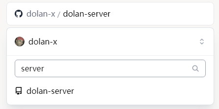
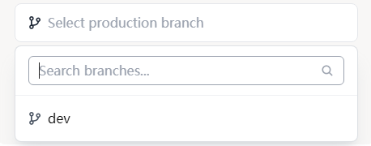
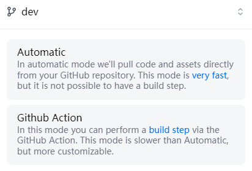
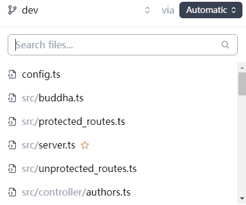
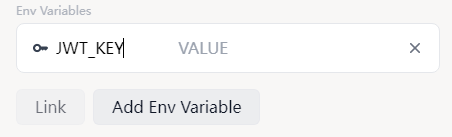

# Deploy Server

## Prepare a database

Dolan supports many databases via [dittorm](https://github.com/walinejs/dittorm) (Currently using [dittorm-deno](https://github.com/so1ve/dittorm-deno), but will be replaced when deno deploy supports `npm:` specifier).

### Deta

Deta is a free database service. You can create a free account at [deta.sh](https://deta.sh/).

Create a new app and get the project key.

## Deploy to Deno deploy

First, fork [this repository](https://github.com/dolan-x/dolan-server).

Then, go to [Deno Deploy](https://dash.deno.com/new) and create a new project.

Select the forked repository:

Then, select the branch:

Then, select the deploy method:

Then, select the file:

Click "Add Env Variable".

Visit <https://jwt-keygen.deno.dev> and copy the result.

Add a new env variable named `JWT_KEY` and paste the result.

Add a new env variable named `STORAGE_TYPE` and input `deta`.

Add a new env variable named `DETA_PROJECT_KEY` and input the project.

Click "Link".